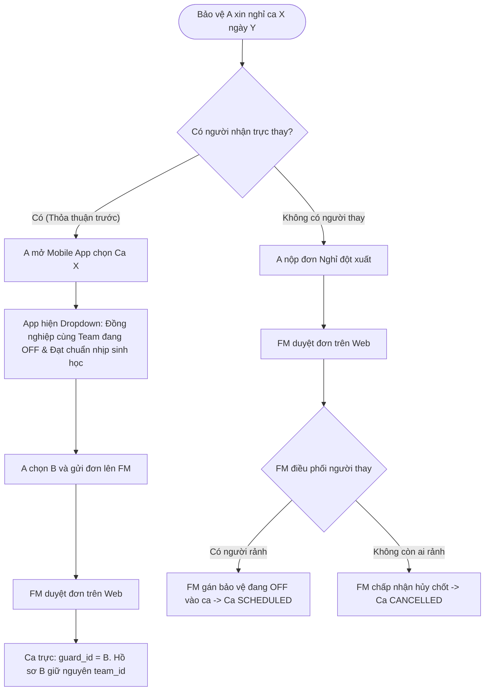

# Mô hình Quản lý Lịch trực & Đổi ca Bảo vệ — ICSSS

> Cập nhật: 23/09/2026. Đồ án Tốt nghiệp FA26SE040 — Hệ thống Giám sát An ninh Khuôn viên Thông minh (ICSSS).

---

## 1. Nguyên tắc Cốt lõi & Tổ chức Phân ca

| Thành phần | Quy định nghiệp vụ |
|---|---|
| **Độ phủ an ninh** | **24/7/365** liên tục không gián đoạn (khác với khối hành chính). |
| **3 Ca tiêu chuẩn** | • **Ca Sáng (`SHIFT_MORNING`):** 06:00 – 14:00 (8 tiếng) • **Ca Chiều (`SHIFT_AFTERNOON`):** 14:00 – 22:00 (8 tiếng) • **Ca Đêm (`SHIFT_NIGHT`):** 22:00 – 06:00 (8 tiếng) |
| **Cơ cấu Đội (Team)** | Bảo vệ được biên chế theo Đội (`team_id`). Mỗi Đội tự quản lý lịch trực và đổi ca nội bộ. |
| **Định mức lao động** | Chuẩn 48h/tuần theo Luật Lao động: Mỗi bảo vệ làm **6 ca/tuần**, nghỉ **1 ngày xoay tua (`SHIFT_OFF`)** rải đều từ Thứ 2 đến Chủ Nhật. |
| **Lưu trữ ngày nghỉ** | Ngày nào bảo vệ không có record trong `guard_shifts` được hệ thống tự động hiểu là **ngày OFF**. Không cần insert record `SHIFT_OFF` làm phình database. |

---

## 2. Cấu hình Nhu cầu Quân số theo Ca & Quy Chuẩn An Ninh Tòa Nhà

### 2.1. Quy chuẩn An ninh Tòa nhà Tối thiểu (Campus Building Security Baseline)
> [!IMPORTANT]
> **Ràng buộc cứng:** Mỗi ca trực hoạt động tại một tòa nhà / cơ sở luôn luôn phải bố trí **ít nhất 2 bảo vệ** ($\ge 2$ người/ca).
> Không cho phép thiết lập 1 bảo vệ/ca vì lý do an toàn tác chiến:
> - **1 người túc trực phòng Trực ban / Camera:** Giám sát liên tục hệ thống camera giám sát thông minh 24/7, tiếp nhận cảnh báo AI Detection và giữ thông tin liên lạc bộ đàm.
> - **1 người cơ động tuần tra thực địa:** Đi tuần định kỳ các tầng, kiểm tra khóa cửa, phòng máy, cửa thoát hiểm và ứng cứu ngay tại hiện trường khi AI phát hiện sự cố.

---

### 2.2. Hồ sơ Phân bổ Lịch Theo Tuần (T2-T7 & Chủ Nhật)

Đặc thù trường đại học có lịch học tập, giảng dạy và làm việc diễn ra từ **Thứ 2 đến Thứ 7**. Riêng **Chủ Nhật** trường đóng cửa các phòng học văn hóa, lưu lượng người giảm đáng kể:

1. **Khung Ngày Học & Làm Việc (Thứ 2 – Thứ 7 • 6 ngày):**
   - **Ca Sáng (06:00 – 14:00):** Cần **3 người** (1 camera + 1 tuần tra + 1 trực sảnh/cổng đón tiếp).
   - **Ca Chiều (14:00 – 22:00):** Cần **4 người** (1 camera + 1 tuần tra + 2 kiểm soát giờ tan học và mở cổng tăng cường).
   - **Ca Đêm (22:00 – 06:00):** Cần **2 người** (1 camera + 1 tuần tra đêm chống đột nhập).
   - $\rightarrow$ Tổng ngày T2–T7: $3 + 4 + 2 = \mathbf{9\text{ ca/ngày}} \times 6\text{ ngày} = \mathbf{54\text{ ca}}$.

2. **Khung Ngày Giảm Tải (Chủ Nhật • 1 ngày):**
   - Hệ thống cho phép bật tùy chỉnh giảm tải Chủ Nhật về mức sàn an ninh tối thiểu:
   - **Ca Sáng (06:00 – 14:00):** **2 người** (1 camera + 1 tuần tra).
   - **Ca Chiều (14:00 – 22:00):** **2 người** (1 camera + 1 tuần tra).
   - **Ca Đêm (22:00 – 06:00):** **2 người** (1 camera + 1 tuần tra).
   - $\rightarrow$ Tổng ngày Chủ Nhật: $2 + 2 + 2 = \mathbf{6\text{ ca/ngày}} \times 1\text{ ngày} = \mathbf{6\text{ ca}}$.

---

### 2.3. Công thức Năng Định Quân Số Tối Ưu (Optimal Staffing Capacity)

$$\text{Tổng ca cần trong tuần} = 6 \times (N_{\text{Sáng, T2-T7}} + N_{\text{Chiều, T2-T7}} + N_{\text{Đêm, T2-T7}}) + 1 \times (N_{\text{Sáng, CN}} + N_{\text{Chiều, CN}} + N_{\text{Đêm, CN}})$$

$$\text{Tổng ca} = 54 + 6 = \mathbf{60\text{ ca/tuần}}$$

$$\text{Quân số tối thiểu (Zero-Slack Headcount)} = \left\lceil \frac{\text{Tổng ca cần trong tuần}}{6 \text{ ca/người/tuần}} \right\rceil = \frac{60}{6} = \mathbf{10\text{ bảo vệ}}$$

- **Định mức:** Mỗi bảo vệ trực đúng **6 ca/tuần**, có đúng **1 ngày nghỉ xoay tua (OFF)**.
- **Biên an toàn dự phòng (+15% Buffer):**
  $$\text{Safe Headcount} = \text{minGuards} + \max(1, \lceil \text{minGuards} \times 0.15 \rceil) = 10 + 2 = \mathbf{12\text{ bảo vệ}}$$
  *(Dự phòng 2 nhân sự khi có người ốm đau, nghỉ phép hoặc tăng cường sự kiện)*.

---

### 2.4. Bảng Ma trận Xoay tua Mẫu (Đội 10 người — 60 ca/tuần)

- **Thứ 2 đến Thứ 7:** 9 ca/ngày $\rightarrow$ 9 người trực + **1 người OFF**.
- **Chủ Nhật:** 6 ca/ngày $\rightarrow$ 6 người trực + **4 người OFF**.
- **Kết quả:** Cả 10 bảo vệ (G1 $\to$ G10) đều hoàn thành đúng **6 ca trực** và được nghỉ đúng **1 ngày OFF** trong tuần.

| Bảo vệ | Thứ 2 | Thứ 3 | Thứ 4 | Thứ 5 | Thứ 6 | Thứ 7 | Chủ Nhật | Tổng ca | Ngày OFF |
| :---: | :---: | :---: | :---: | :---: | :---: | :---: | :---: | :---: | :---: |
| **G1** | **OFF** | S | S | C | C | Đ | S | **6 ca** | Thứ 2 |
| **G2** | S | **OFF** | S | C | C | Đ | S | **6 ca** | Thứ 3 |
| **G3** | S | S | **OFF** | C | C | C | C | **6 ca** | Thứ 4 |
| **G4** | S | S | S | **OFF** | C | C | C | **6 ca** | Thứ 5 |
| **G5** | C | C | C | C | **OFF** | C | Đ | **6 ca** | Thứ 6 |
| **G6** | C | C | C | C | C | **OFF** | Đ | **6 ca** | Thứ 7 |
| **G7** | C | C | C | S | S | S | **OFF** | **6 ca** | Chủ Nhật |
| **G8** | C | C | C | S | S | S | **OFF** | **6 ca** | Chủ Nhật |
| **G9** | Đ | Đ | Đ | Đ | Đ | Đ | **OFF** | **6 ca** | Chủ Nhật |
| **G10**| Đ | Đ | Đ | Đ | Đ | Đ | **OFF** | **6 ca** | Chủ Nhật |
| **Ca Sáng (S)** | **3** | **3** | **3** | **3** | **3** | **3** | **2** | **20 ca** | |
| **Ca Chiều (C)**| **4** | **4** | **4** | **4** | **4** | **4** | **2** | **26 ca** | |
| **Ca Đêm (Đ)** | **2** | **2** | **2** | **2** | **2** | **2** | **2** | **14 ca** | |
| **Tổng trực/ngày**| **9** | **9** | **9** | **9** | **9** | **9** | **6** | **60 ca** | |
| **Nghỉ (OFF)** | **1** | **1** | **1** | **1** | **1** | **1** | **4** | **10 lượt**| |

---

## 3. Cơ chế Lịch Mẫu & Sinh Lịch Tự Động (Auto-Generate Wizard)

FM **không phải nhập tay từng ô hàng tuần**. Hệ thống cung cấp:

1. **Trình tạo khung mẫu tự động (Staffing Wizard Modal):**
   - FM nhập: Số người Ca Sáng, Chiều, Đêm $\rightarrow$ Bấm `[Tự động tạo khung xoay tua]`.
   - Backend chạy thuật toán ma trận tuần hoàn (Circulant Shift Matrix) tự sinh dữ liệu và lưu vào `guard_schedule_templates` hoặc trực tiếp tạo ca tuần.
2. **Sinh lịch hàng loạt (Bulk Generation API):**
   - Mỗi đầu tuần/tháng, FM chỉ bấm 1 nút `[Sinh lịch từ Lịch Mẫu]` (`POST /api/guard-shifts/generate-from-templates`).
   - Toàn bộ ca trực của cả tuần được sinh ra trong 1 giây.

---

## 4. Quy tắc Đổi ca & Xin Nghỉ Phép (Shift Swap & Leave)

### 4.1. Điều kiện xác định người "Rảnh" (Available Substitute)
Khi A xin nghỉ ca trực $S$ ngày $T$, API `GET /api/guard-shifts/available-substitutes` chỉ trả về những đồng nghiệp thỏa mãn:
1. Cùng `team_id` với A và đang hoạt động.
2. Ngày $T$ đang có lịch **OFF** (không có bất kỳ ca trực nào trong ngày).
3. **Quy tắc bảo vệ nhịp sinh học 2 chiều (Bi-directional Circadian Check):**
   - **Kiểm tra lùi (Backward):** Nếu $S$ là **Ca Sáng (06:00)**: Chặn người vừa hoàn thành **Ca Đêm ngày hôm trước ($T-1$)** vì vừa tan ca lúc 06:00 sáng nay, 0 giờ nghỉ ngơi.
   - **Kiểm tra tiến (Forward):** Nếu $S$ là **Ca Đêm (22:00 ngày $T$ – 06:00 ngày $T+1$)**: Chặn người đã có **Ca Sáng vào ngày hôm sau ($T+1$)** vì ca đêm tan lúc 06:00 sáng, họ sẽ phải trực tiếp ngay ca sáng, 0 giờ nghỉ ngơi.

### 4.2. Thời hạn nộp đơn (Lead Time)
- Ca trực đã qua hoặc đang diễn ra (`CHECKED_IN`): Bị chặn nộp đơn.
- Đơn Nhờ trực thay (`SWAP_SHIFT`): Bắt buộc nộp **trước giờ ca bắt đầu tối thiểu 2 giờ**.
- Đơn Xin nghỉ (`LEAVE_REQUEST`): Phải nộp **trước giờ ca bắt đầu**.

### 4.3. Bảng Chuyển Đổi Trạng Thái Xử Lý Đơn

| Kịch bản | Trạng thái Đơn (`guard_shift_requests`) | Trạng thái Ca trực (`guard_shifts`) | Nhân sự trực (`guard_id`) |
|---|---|---|---|
| **A nộp đơn nhờ B trực thay** | `PENDING` | `SCHEDULED` | A |
| **A nộp đơn xin nghỉ đột xuất** | `PENDING` | `SCHEDULED` | A |
| **FM duyệt đơn nhờ trực thay** | `APPROVED` | `SCHEDULED` | Chuyển sang B (`substitute_guard_id`) |
| **FM duyệt đơn nghỉ & gán C thay** | `APPROVED` | `SCHEDULED` | Chuyển sang C (người FM chọn) |
| **FM duyệt đơn nghỉ & chấp nhận hủy ca** | `APPROVED` | `CANCELLED` | A (lưu vết) |
| **FM từ chối đơn** | `REJECTED` | `SCHEDULED` | A (phải đi trực) |

---

## 5. Xử lý Sự kiện Đặc biệt & Tuân Thủ Pháp Luật Lao Động

### 5.1. Căn cứ Pháp lý về Làm Thêm Giờ (OT) theo BLLĐ 2019
* **Điều 107 BLLĐ 2019 & Điều 60 NĐ 145/2020/NĐ-CP:**
  - Giờ làm thêm không quá 50% giờ làm việc bình thường/ngày (tối đa 4 giờ/ngày).
  - Tổng giờ làm việc bình thường và giờ làm thêm **không quá 12 giờ/ngày**.
  - **Do đó, ca đúp 16 giờ trong vận hành thường nhật là vi phạm pháp luật.**
* **Phương thức Tăng Ca (OT) Hợp Pháp Chuẩn:**
  - Huy động bảo vệ đang trong ngày nghỉ **OFF** đi làm ca tăng cường sự kiện (8h/ngày, `is_overtime = true`). Như vậy bảo vệ vẫn chỉ làm 8h/ngày $\le 12$h/ngày.
* **Ngoại lệ Khẩn cấp Đặc biệt (Điều 108 BLLĐ 2019):**
  - Chỉ áp dụng khi có tình huống thảm họa, thiên tai, hỏa hoạn, bảo vệ tính mạng tài sản khẩn cấp theo lệnh huy động an ninh. Khi đó FM mới được phép kích hoạt cờ `"Emergency Override"` để điều động ca đúp 16h kèm lưu log kiểm toán.

### 5.2. Tổ chức Ca Sự Kiện Khuôn Viên
Khi có sự kiện lớn ở trường (Hội thao, Đại nhạc hội tại Sân vận động):
1. **Khung giờ sự kiện:** Bố trí trọn vẹn trong **Ca Chiều (14:00 – 22:00)** hoặc ca tiêu chuẩn 8 tiếng để nhân sự có thời gian chuẩn bị và giải tán.
2. **Phân bổ theo vị trí (`area_id`):** FM huy động thêm quân số và gán khu vực rõ ràng:
   - *Nhóm Cổng chính:* `area_id = CỔNG CHÍNH` (Kiểm soát xe cộ, soát vé vòng ngoài).
   - *Nhóm Sân vận động:* `area_id = SÂN VẬN ĐỘNG` (Kiểm soát khán đài, sân khấu vòng trong).

### 5.3. Liên Kết Tác Chiến với AI Camera & Incident Dispatching
* **Cơ chế điều phối thông minh:** Khi Camera AI phát hiện sự cố an ninh (đánh nhau, đột nhập, hỏa hoạn) tại một vị trí (`area_id`), hệ thống tra cứu ngay ca trực đang diễn ra (`status = CHECKED_IN`) tại vị trí đó.
* **Cảnh báo đích danh:** Gửi cảnh báo khẩn cấp kèm hình ảnh/video sự cố trực tiếp đến điện thoại bảo vệ đang đứng chốt tại vị trí đó để xử lý ngay tức thì.
* **Leo thang khi thiếu người:** Nếu ca trực tại chốt đó bị hủy (`CANCELLED`), hệ thống tự động cảnh báo lên Web Dashboard của FM và toàn bộ Tổ an ninh cơ động để chi viện.

---

## 6. Ranh giới Hệ thống (System Boundary — Tránh Scope Creep)

> [!IMPORTANT]
> **Hệ thống ICSSS là Hệ thống Giám sát An ninh AI & Điều phối tác chiến, KHÔNG PHẢI Phần mềm Kế toán - Chấm công tính lương (Payroll/HRMS).**

| Những gì hệ thống CẦN làm | Những gì hệ thống KHÔNG làm |
|---|---|
| ✅ Ghi nhận chính xác giờ `check_in_at` và `check_out_at`. | ❌ Không tính số tiền lương (VND). |
| ✅ Đếm tổng số ca tiêu chuẩn và ca tăng cường (`is_overtime`). | ❌ Không nhân hệ số làm thêm x1.5, x2.0, x3.0. |
| ✅ Ghi nhận vị trí (`area_id`) và sự cố đã xử lý. | ❌ Không tính bảo hiểm, thuế TNCN, trừ phép năm. |
| ✅ **Xuất báo cáo / Excel chấm công ca trực:** Để gửi sang phòng Nhân sự/Kế toán của trường tự động tính lương. | ❌ Không giải quyết khiếu nại bảng lương. |

---

## 7. Triết Lý Thiết Kế Giao Diện Tối Giản (Minimalist UI Design)

Theo định hướng tối ưu hóa trải nghiệm người dùng (UX) và giảm tải nhận thức (Cognitive Load) cho Cán bộ Quản lý Cơ sở vật chất (FM):

1. **Ma trận Nhu cầu 2 Hàng (Compact 2-Row Matrix):**
   - Thay vì hiển thị 6 khối thẻ lớn chiếm nhiều diện tích cuộn màn hình, giao diện gom cụm thành bảng ma trận trực quan gồm 2 dòng: `Thứ 2 - Thứ 7` (6 ngày học & làm việc) và `Chủ Nhật` (1 ngày giảm tải).
   - Bộ điều chỉnh quân số (`[ - ] [ N ] [ + ]`) được tích hợp inline nhỏ gọn ngay tại từng ô ca trực (Sáng, Chiều, Đêm).
2. **Thanh Tóm Tắt Năng Định Tinh Gọn (Inline Capacity Bar):**
   - Thay thế các thẻ đề xuất cồng kềnh bằng thanh trạng thái 1 dòng: Hiển thị ngay tổng số ca/tuần, số bảo vệ tối thiểu cần thiết, số bảo vệ dự phòng an toàn, và huy hiệu đếm tiến độ (`Đã chọn: X / Y BV`).
   - Tích hợp nút bấm hành động tức thì `[⚡ Chọn nhanh N bảo vệ]` giúp FM hoàn tất lập đội chỉ bằng 1 cú nhấp chuột.
3. **Phân Định Trách Nhiệm Giao Diện và Tài Liệu (Separation of Concerns):**
   - Giao diện tập trung 100% vào thao tác cấu hình và hiển thị thị giác nhanh, loại bỏ các banner thông báo quy chuẩn dài dòng gây xao nhãng.
   - Toàn bộ cơ sở lý thuyết, quy chuẩn an ninh ($\ge 2$ bảo vệ/ca), công thức định mức và căn cứ pháp lý được quy định tập trung, đầy đủ trong tài liệu kỹ thuật này.

---

## 8. Cơ Chế Điều Động Bảo Vệ Tăng Cường Theo Thời Gian (Temporary Event Dispatch)

### 8.1. Bối cảnh & Vấn đề Thiết kế
* Khi có sự kiện đặc biệt (Hội thao, Đại nhạc hội, Hội thảo quốc tế, Lễ khai giảng): Ban quản lý cần huy động thêm bảo vệ từ đội khác hoặc nhân sự dự phòng về đội bảo vệ phụ trách tòa nhà diễn ra sự kiện.
* **Vấn đề với đổi đội vĩnh viễn:** Nếu thay đổi trực tiếp `users.team_id`, nhân sự sẽ bị mất liên kết với đội ban đầu, dễ thất lạc dữ liệu và phải thực hiện thao tác thủ công để chuyển ngược lại sau khi sự kiện kết thúc.
* **Yêu cầu cảnh báo sự cố (Incident Alert Routing):** Hệ thống ICSSS định tuyến cảnh báo AI Camera theo từng cơ sở/tòa nhà (`building`) và gửi WebSocket tới các thành viên thuộc đội trực tại cơ sở đó (`/topic/buildings/{BUILDING}/alerts`). Do đó, bảo vệ được tăng cường **phải tạm thời thuộc về đội mục tiêu trong suốt thời gian diễn ra sự kiện** để nhận được đầy đủ cảnh báo sự cố khẩn cấp.

### 8.2. Giải Pháp: Bảng Điều Động Có Thời Hạn & Khung Ca (`guard_team_dispatches`)
1. **Mô hình Dữ liệu:**
   - Bảng `guard_team_dispatches` lưu vết: `guard_id`, `from_team_id`, `to_team_id`, `start_date`, `end_date`, `shift_type` (`SHIFT_MORNING`, `SHIFT_AFTERNOON`, `SHIFT_NIGHT`, hoặc `NULL` - cả ngày), `reason`, `status` (`ACTIVE`, `COMPLETED`, `CANCELLED`).
   - Đội gốc của bảo vệ (`users.team_id`) được giữ nguyên vẹn 100%.
2. **Cơ chế Điều phối Quyền Hạn Theo Ca (Shift-Level Authority):**
   - **Trao quyền đúng ca trực:** Khi sự kiện chỉ diễn ra trong 1 buổi (ví dụ Hội thao chiều), FM chọn tăng cường cho **Ca Chiều (14:00 – 22:00)**.
   - **Trong ca trực:** Nhân viên mang quyền hạn và nhận cảnh báo sự cố từ AI Camera của cơ sở/tòa nhà diễn ra sự kiện.
   - **Ngoài ca trực / Hết ca:** Nhân viên không còn bị ràng buộc với đội sự kiện, tự động quay về đội gốc trong các ca còn lại của ngày (ví dụ Ca Sáng vẫn có thể trực cho đội gốc).
   - **Ma trận Lịch trực:** Hiển thị huy hiệu `⚡ Tăng cường: [Tên Đội] (Chiều)` trên ma trận lịch trực.
   - **Tự động hoàn trả (Auto-revert):** Khi hết ca hoặc hết hạn `end_date`, hệ thống tự động hoàn trả quyền hạn về đội gốc.
3. **Cấu hình Nhu cầu Chủ Nhật Trực Tiếp:**
   - Loại bỏ nút gạt On/Off gây hiểu nhầm tại ngày Chủ Nhật. An ninh trường học vận hành 24/7/365.
   - Ngày Chủ Nhật luôn hiển thị trực tiếp hàng cấu hình với mặc định chuẩn 2 - 2 - 2 (đảm bảo điều kiện tối thiểu 1 quan sát camera + 1 tuần tra cơ động).

