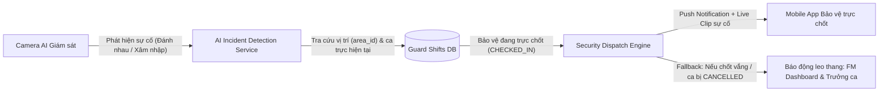

# Thiết Kế Chi Tiết: Quản Lý Phân Ca & Quy Trình Đổi Ca, Xin Nghỉ Bảo Vệ (Guard Shift Management & Swap Requests)

> **Mã tài liệu:** SPEC-GUARD-SHIFT-2026-09-23  
> **Dự án:** FA26SE040 — Hệ thống Giám sát An ninh Khuôn viên Thông minh (ICSSS)  
> **Ngày cập nhật:** 23/09/2026  
> **Tác giả:** Đội ngũ phát triển ICSSS  
> **Trạng thái:** Đã tinh chỉnh & Khép kín kỹ thuật (Final Architecture Review)

---

## 1. Tổng Quan & Mục Tiêu

### 1.1. Bối cảnh
Hệ thống ICSSS vận hành an ninh khuôn viên 24/7/365. Công việc bảo vệ yêu cầu tính liên tục, nghiêm ngặt về phân công nhiệm vụ và phản ứng nhanh khi có sự cố. Trước đây, việc tạo ca trực thực hiện thủ công từng ô và chưa có quy trình chuẩn hóa cho việc bảo vệ xin nghỉ phép hoặc đổi ca trực khi có việc bận đột xuất.

### 1.2. Mục tiêu thiết kế
1. **Quản lý Tổ / Đội (Guard Teams):** Phân chia lực lượng bảo vệ thành các đội chuyên trách có định danh rõ ràng.
2. **Trình Tính Định Biên & Sinh Ca Theo Nhu Cầu (Demand-Driven Staffing & Shift Wizard):** FM nhập số lượng chốt bảo vệ cần thiết cho từng ca (Sáng, Chiều, Đêm), hệ thống tự động tính toán quy mô nhân sự tối ưu cho Đội và sinh lịch xoay tua tuần hoàn.
3. **Quy trình Đổi ca & Xin nghỉ phép (Shift Swap & Leave Workflow):** Bảo vệ gửi yêu cầu trực tiếp từ ứng dụng Mobile; FM xét duyệt trên Web; hệ thống tự động chuyển giao ca trực và gửi thông báo.
4. **Quy tắc nghiêm ngặt về an toàn lao động & Nhịp sinh học:** Mỗi bảo vệ làm việc tối đa 1 ca/ngày (8 tiếng). Chặn vi phạm nhịp sinh học cả 2 chiều (trước và sau ca đêm). Chỉ đồng nghiệp đang có lịch nghỉ trong ngày mới được tiếp nhận trực thay.
5. **Ranh giới hệ thống:** Tập trung vào Giám sát An ninh & Điều phối Tác chiến; không mở rộng sang bài toán Tính Lương (Payroll).

---

## 2. Quy Định Nghiệp Vụ Cốt Lõi (Business Rules)

### 2.1. Khung giờ ca trực chuẩn
Một ngày bao gồm đúng 3 khung giờ ca trực tiêu chuẩn cố định:
* **Ca Sáng (`SHIFT_MORNING`):** 06:00 – 14:00 (8 tiếng)
* **Ca Chiều (`SHIFT_AFTERNOON`):** 14:00 – 22:00 (8 tiếng)
* **Ca Đêm (`SHIFT_NIGHT`):** 22:00 – 06:00 (8 tiếng)

### 2.2. Quy tắc 1 ca/ngày & Tuân thủ Bộ luật Lao động 2019 về Làm thêm giờ (OT)
* **Quy chuẩn thường ngày:** Mỗi bảo vệ chỉ làm việc tối đa đúng 1 ca trong 1 ngày (8 tiếng/ngày). Định mức lao động tuần: 6 ca/tuần (48 tiếng), được hưởng ít nhất 1 ngày nghỉ xoay tua trong tuần.
* **Căn cứ Pháp lý (Điều 107 BLLĐ 2019 & Điều 60 NĐ 145/2020/NĐ-CP):**
  - Thời gian làm thêm giờ không quá 50% số giờ làm việc bình thường trong 01 ngày (tối đa 4 giờ/ngày).
  - Trường hợp áp dụng quy định làm việc theo tuần thì tổng số giờ làm việc bình thường và giờ làm thêm không quá **12 giờ trong 01 ngày**.
  - Do đó, việc bố trí bảo vệ làm "ca đúp 16 giờ" (2 ca 8h liên tiếp) trong điều kiện vận hành thường nhật là **vi phạm trần giờ làm việc tối đa theo luật định**.
* **Phương án Làm thêm giờ (OT) tiêu chuẩn cho Sự kiện khuôn viên:**
  - **Huy động bảo vệ đang có lịch nghỉ (`OFF`):** Điều động bảo vệ đang trong ngày nghỉ xoay tua đi làm nhiệm vụ sự kiện. Vẫn đảm bảo đúng 1 ca/ngày (8 giờ làm việc trong ngày $\le$ trần 12 giờ), ca này được đánh dấu cờ `is_overtime = true` (tuần đó bảo vệ làm 7 ca = 56 giờ, phát sinh 1 ca OT hợp chuẩn).
* **Ngoại lệ khẩn cấp đặc biệt (Emergency Override theo Điều 108 BLLĐ 2019):**
  - Điều 108 BLLĐ 2019 cho phép người sử dụng lao động huy động làm thêm giờ không bị giới hạn số giờ trong các tình huống đặc biệt: thực hiện nhiệm vụ bảo đảm quốc phòng, an ninh; bảo vệ tính mạng con người, tài sản cơ quan khi xảy ra thảm họa, thiên tai, hỏa hoạn nghiêm trọng.
  - Chỉ trong trường hợp khẩn cấp này, FM mới có thẩm quyền kích hoạt cờ `"Ngoại lệ Khẩn cấp: Cho phép tăng ca ca thứ 2"` để bảo vệ trực tiếp ca thứ 2 trong ngày (tối đa 16 tiếng). Hệ thống bắt buộc FM nhập lý do khẩn cấp và lưu log kiểm toán chặt chẽ.

### 2.3. Quy tắc Đổi ca & Xin nghỉ
1. **Phạm vi thẩm quyền:** Bảo vệ chỉ được nhờ đồng nghiệp trong cùng Tổ/Đội (`team_id`) trực thay.
2. **Điều kiện người trực thay:** Chỉ những đồng nghiệp **đang có lịch nghỉ (ngày OFF - không có ca trực nào)** trong ngày diễn ra ca trực mới hợp lệ để nhận thay.
3. **Bảo vệ nhịp sinh học 2 chiều (Bi-directional Circadian Fatigue Check):**
   - **Backward Check (Kiểm tra lùi):** Nếu ca cần thay là **Ca Sáng (06:00 - 14:00 ngày $T$)**, loại bỏ ứng viên đã có Ca Đêm hôm trước ($T-1$, kết thúc lúc 06:00 sáng nay) vì vừa tan ca, không có thời gian ngủ và hồi phục sức khỏe.
   - **Forward Check (Kiểm tra tiến):** Nếu ca cần thay là **Ca Đêm (22:00 ngày $T$ – 06:00 ngày $T+1$)**, loại bỏ ứng viên đã có Ca Sáng ngày hôm sau ($T+1$, bắt đầu lúc 06:00) vì ứng viên vừa hết ca đêm lúc 06:00 sẽ phải trực tiếp ngay ca sáng (0 giờ nghỉ ngơi).
4. **Quy định thời hạn nộp đơn (Lead Time Enforcement):**
   - Không được nộp đơn cho các ca trực trong quá khứ hoặc ca đang diễn ra (`CHECKED_IN`).
   - Đơn Đổi ca (`SWAP_SHIFT`): Bắt buộc nộp trước giờ ca bắt đầu **tối thiểu 2 giờ** để đồng nghiệp kịp chuẩn bị di chuyển và FM kịp phê duyệt.
   - Đơn Xin nghỉ (`LEAVE_REQUEST`): Bắt buộc nộp **trước giờ ca bắt đầu**. Trường hợp phát sinh ốm đau/sự cố bất khả kháng ngay trong ca trực, bảo vệ phải liên hệ trực tiếp bộ đàm cho FM để xử lý bàn giao chốt tại chỗ.
5. **Quy trình phê duyệt & Chuyển giao:**
   - Bảo vệ A nộp đơn chọn Bảo vệ B $\rightarrow$ Đơn gửi lên Dashboard của FM.
   - FM duyệt $\rightarrow$ Ca trực cập nhật chủ sở hữu sang B (`guard_id = B`). Hồ sơ nhân sự của B giữ nguyên `team_id`.
   - Nghỉ đột xuất (không có người thay): FM duyệt $\rightarrow$ FM có thể gán người đang nghỉ vào thay thế, hoặc chấp nhận hủy ca trực (`CANCELLED`) để giảm chốt an ninh tạm thời.

---

## 3. Thiết Kế Cơ Sở Dữ Liệu (Database Migration V39)

### 3.1. Bảng `guard_teams`
Quản lý danh sách các Tổ/Đội bảo vệ cơ hữu và đội sự kiện.

```sql
CREATE TABLE IF NOT EXISTS guard_teams (
    id UUID PRIMARY KEY DEFAULT gen_random_uuid(),
    team_name VARCHAR(100) NOT NULL UNIQUE,
    description TEXT,
    is_active BOOLEAN NOT NULL DEFAULT TRUE,
    created_at TIMESTAMPTZ NOT NULL DEFAULT CURRENT_TIMESTAMP,
    updated_at TIMESTAMPTZ NOT NULL DEFAULT CURRENT_TIMESTAMP
);
```

### 3.2. Cập nhật bảng `users`
Bổ sung liên kết khóa ngoại tới đội bảo vệ.

```sql
ALTER TABLE users ADD COLUMN IF NOT EXISTS team_id UUID REFERENCES guard_teams(id) ON DELETE SET NULL;
CREATE INDEX IF NOT EXISTS idx_users_team_id ON users(team_id);
```

### 3.3. Bảng `guard_shift_requests`
Lưu trữ toàn bộ vòng đời đơn từ đổi ca và xin nghỉ phép của nhân viên an ninh. Sử dụng `ON DELETE RESTRICT` để bảo toàn vết kiểm toán pháp lý (Audit Trail) ngay cả khi ca trực có biến động, kết hợp snapshot các trường thông tin ca trực gốc.

```sql
CREATE TABLE IF NOT EXISTS guard_shift_requests (
    id UUID PRIMARY KEY DEFAULT gen_random_uuid(),
    requester_id UUID NOT NULL REFERENCES users(id) ON DELETE RESTRICT,
    shift_id UUID NOT NULL REFERENCES guard_shifts(id) ON DELETE RESTRICT,
    request_type VARCHAR(20) NOT NULL CHECK (request_type IN ('SWAP_SHIFT', 'LEAVE_REQUEST')),
    substitute_guard_id UUID REFERENCES users(id) ON DELETE SET NULL,
    
    -- target_shift_id: Dự phòng mở rộng cho Phase tương lai (đổi ca 2 chiều - Shift Exchange: A đổi ca T3 với ca T5 của B).
    -- Hiện tại hệ thống vận hành mô hình 1 chiều (Shift Coverage: A nhờ B trực thay vào ngày B đang OFF).
    target_shift_id UUID REFERENCES guard_shifts(id) ON DELETE SET NULL,
    
    -- Snapshot ca trực để bảo toàn dữ liệu lịch sử ngay cả khi ca trực bị chỉnh sửa
    shift_date_snapshot DATE,
    shift_type_snapshot VARCHAR(20),
    start_time_snapshot TIME,
    end_time_snapshot TIME,
    
    reason TEXT NOT NULL,
    status VARCHAR(20) NOT NULL DEFAULT 'PENDING' 
        CHECK (status IN ('PENDING', 'APPROVED', 'REJECTED', 'CANCELLED')),
    reviewed_by UUID REFERENCES users(id) ON DELETE SET NULL,
    reviewed_at TIMESTAMPTZ,
    review_notes TEXT,
    created_at TIMESTAMPTZ NOT NULL DEFAULT CURRENT_TIMESTAMP,
    updated_at TIMESTAMPTZ NOT NULL DEFAULT CURRENT_TIMESTAMP,

    -- Đơn SWAP_SHIFT bắt buộc phải có người trực thay chỉ định
    CONSTRAINT chk_swap_has_substitute CHECK (request_type != 'SWAP_SHIFT' OR substitute_guard_id IS NOT NULL)
);

CREATE INDEX IF NOT EXISTS idx_shift_requests_requester ON guard_shift_requests(requester_id);
CREATE INDEX IF NOT EXISTS idx_shift_requests_shift ON guard_shift_requests(shift_id);
CREATE INDEX IF NOT EXISTS idx_shift_requests_status ON guard_shift_requests(status);
-- Chặn race condition: Mỗi ca trực chỉ có duy nhất 1 đơn PENDING tại một thời điểm
CREATE UNIQUE INDEX IF NOT EXISTS uq_pending_shift_request ON guard_shift_requests(shift_id) WHERE status = 'PENDING';
```

### 3.4. Bổ sung cờ làm thêm giờ OT vào bảng ca trực
```sql
ALTER TABLE guard_shifts ADD COLUMN IF NOT EXISTS is_overtime BOOLEAN NOT NULL DEFAULT FALSE;
```

### 3.5. Dữ liệu khởi tạo (Seed Data)
```sql
INSERT INTO guard_teams (id, team_name, description) VALUES
    ('11111111-1111-1111-1111-111111111111', 'Tổ 1 - An ninh Cổng & Vòng ngoài', 'Phụ trách cổng chính, cổng phụ và bãi xe'),
    ('22222222-2222-2222-2222-222222222222', 'Tổ 2 - Giám sát & Tuần tra', 'Phụ trách phòng camera và tuần tra khuôn viên')
ON CONFLICT (team_name) DO NOTHING;

UPDATE users 
SET team_id = '11111111-1111-1111-1111-111111111111' 
WHERE role = 'GUARD' AND team_id IS NULL;
```

---

## 4. Thiết Kế Backend Services, Thuật Toán & APIs

### 4.1. Danh mục API RESTful

#### A. Phân hệ Quản lý Tổ Đội (`/api/guard-teams`)
* `GET /api/guard-teams`: Lấy danh sách đội kèm số lượng thành viên hiện tại.
* `POST /api/guard-teams`: Tạo đội mới (Body: `teamName`, `description`).
* `PUT /api/guard-teams/{id}`: Cập nhật thông tin đội.
* `PUT /api/guard-teams/{id}/members`: Gán/cập nhật danh sách bảo vệ vào đội (Body: `guardIds: UUID[]`).

#### B. Phân hệ Tính Nhu Cầu & Sinh Lịch Tự Động (`/api/guard-shifts/wizard`)
* `POST /api/guard-shifts/wizard/calculate-capacity`:
  - **Request Body:** `{ "morningDemand": 3, "afternoonDemand": 4, "nightDemand": 2 }`
  - **Response:**
    ```json
    {
      "dailyTotalShifts": 9,
      "weeklyTotalShifts": 63,
      "recommendedHeadcount": 11,
      "safeHeadcount": 13,
      "averageShiftsPerGuard": 5.73,
      "restDaysPerGuard": 1.27
    }
    ```
* `POST /api/guard-shifts/wizard/generate`:
  - Sinh ca xoay tua tuần hoàn dựa trên thuật toán Ma Trận Tuần Hoàn (Circulant Shift Matrix).
  - Hỗ trợ cả đội có sẵn lẫn tạo nhanh đội sự kiện mới.

#### C. Bảng Chuyển Đổi Trạng Thái Rõ Ràng (State Transition Matrix)

| Hành động | Trạng thái Đơn (`guard_shift_requests`) | Trạng thái Ca trực (`guard_shifts`) | Người chịu trách nhiệm ca (`guard_id`) |
|---|---|---|---|
| **Bảo vệ nộp đơn Đổi ca** | $\to$ `PENDING` | `SCHEDULED` (giữ nguyên) | Bảo vệ A (người làm đơn) |
| **Bảo vệ nộp đơn Nghỉ đột xuất** | $\to$ `PENDING` | `SCHEDULED` (giữ nguyên) | Bảo vệ A |
| **FM Duyệt Đổi ca** | $\to$ `APPROVED` | `SCHEDULED` | Chuyển sang Bảo vệ B (`substitute_guard_id`) |
| **FM Duyệt Nghỉ (có người thay)** | $\to$ `APPROVED` | `SCHEDULED` | Chuyển sang Bảo vệ C (FM chọn người rảnh) |
| **FM Duyệt Nghỉ (chấp nhận hủy ca)** | $\to$ `APPROVED` | $\to$ `CANCELLED` | Bảo vệ A (hoặc xóa/giữ nguyên để lưu vết) |
| **FM Từ chối đơn** | $\to$ `REJECTED` | `SCHEDULED` (giữ nguyên) | Bảo vệ A (buộc phải đi trực) |
| **Bảo vệ tự hủy đơn trước khi duyệt** | $\to$ `CANCELLED` | `SCHEDULED` (giữ nguyên) | Bảo vệ A |

> [!NOTE]
> Phân biệt rạch ròi: `guard_shift_requests.status = APPROVED` thể hiện nguyện vọng của nhân viên được FM chấp thuận; còn `guard_shifts.status = CANCELLED` là quyết định quản lý vận hành khi không thể bố trí người thay thế chốt trực.

### 4.2. Thuật toán Lọc Bảo Vệ Khả Dụng (`available-substitutes`)
Khi nhân viên A nộp đơn cho ca trực $S$ (ngày $T$, loại ca $S_{type}$), danh sách ứng viên $C$ được tuyển chọn qua 5 bước lọc nghiêm ngặt:

1. **Lọc phạm vi Đội:** $C$ thuộc cùng `team_id` với A, có `role = 'GUARD'`, đang hoạt động (`is_active = true`), và $C \ne A$.
2. **Quy tắc 1 ca/ngày:** Loại bỏ các ứng viên đã có bất kỳ ca trực nào trong ngày $T$ (`shift_date = T`). Chỉ người đang có lịch **OFF** trong ngày $T$ mới được tiếp tục.
3. **Backward Circadian Check (Kiểm tra lùi ca đêm hôm trước):**
   - Nếu ca $S$ là `SHIFT_MORNING` (06:00 – 14:00 ngày $T$):
   - Truy vấn ca trực của $C$ vào ngày $T-1$. Nếu $C$ có ca `SHIFT_NIGHT` (22:00 – 06:00), loại bỏ $C$ (vì vừa tan ca lúc 06:00 sáng nay, 0 giờ nghỉ ngơi).
4. **Forward Circadian Check (Kiểm tra tiến ca sáng hôm sau):**
   - Nếu ca $S$ là `SHIFT_NIGHT` (22:00 ngày $T$ – 06:00 ngày $T+1$):
   - Truy vấn ca trực của $C$ vào ngày $T+1$. Nếu $C$ đã có ca `SHIFT_MORNING` (06:00 – 14:00), loại bỏ $C$ (vì ca đêm kết thúc lúc 06:00 ngày $T+1$, $C$ sẽ phải trực tiếp ngay ca sáng, 0 giờ nghỉ ngơi).
5. **Định dạng kết quả:** Trả về danh sách gồm `id`, `fullName`, `userCode`. Không chèn thêm ký hiệu hay nhãn rườm rà.

### 4.3. Đặc tả Thuật toán Sinh Lịch Tự Động (Circulant Shift Matrix Generation)
Thuật toán phân ca trong `/wizard/generate` vận hành theo nguyên lý Ma trận Tuần hoàn Thuận chiều Sinh học (Forward Circadian Rolling):

```
Thuật toán: CirculantShiftMatrixGenerator
Đầu vào:
  - Danh sách bảo vệ: G = [g_0, g_1, ..., g_{K-1}] với K >= recommendedHeadcount
  - Nhu cầu ca mỗi ngày: D = (N_morning, N_afternoon, N_night)
  - Khoảng thời gian: 7 ngày (Thứ 2 -> Chủ Nhật)

Các bước:
1. Xây dựng Chuỗi Ca Mẫu Tuần Hoàn (Base Weekly Pattern) P:
   - Gom tuần tự: [N_morning ca S, N_afternoon ca C, N_night ca Đ, N_off ca OFF]
   - Chiều dài pattern: L = dailyDemand + dailyOff = K.
   - Sắp xếp thuận chu kỳ sinh học: SÁNG -> CHIỀU -> ĐÊM -> OFF -> SÁNG.
   
2. Kiểm tra tính bất biến an toàn (Circadian Invariant):
   - Không tồn tại chuyển tiếp ĐÊM -> SÁNG liên tiếp.
   - Sau ca ĐÊM bắt buộc phải là OFF hoặc khoảng nghỉ >= 16 giờ.

3. Sinh Ma Trận Lịch Cho K Bảo Vệ qua 7 Ngày:
   For guard_index i from 0 to K-1:
       offset_i = (i * step) mod K  (với step nguyên tố cùng nhau với K)
       For day d from 0 to 6:
           shift_type = P[(d + offset_i) mod K]
           If shift_type != OFF:
               Tạo ca trực GuardShift(guard = g_i, date = startDate + d, type = shift_type)
               
4. Kiểm toán tổng ca:
   Mỗi ngày luôn có đúng N_morning ca Sáng, N_afternoon ca Chiều, N_night ca Đêm.
```

### 4.4. Phân Tích Buffer Headcount (+10% đến 15% Biên Quân Số An Toàn)
Công thức định biên toán học:
$$\text{Quân số tối thiểu (Zero-Slack)} = \left\lceil \frac{7 \times (N_{\text{Sáng}} + N_{\text{Chiều}} + N_{\text{Đêm}})}{6} \right\rceil$$

* Ngưỡng tối thiểu trên giả định **100% nhân sự khỏe mạnh tuyệt đối và sẵn sàng làm việc cả 52 tuần/năm**.
* Trong thực tế vận hành an ninh trường học, luôn có tỷ lệ ốm đau, việc gia đình đột xuất hoặc nghỉ phép năm ($5\% - 10\%$). Nếu chỉ tuyển dụng đúng quân số tối thiểu, khi 1 người nghỉ đột xuất thì toàn đội sẽ cạn kiệt người thay thế (hoặc buộc phải dùng ca đúp vi phạm luật).
* **Khuyến nghị Biên An Toàn (Safe Headcount):**
  $$\text{Safe Headcount} = \text{minGuards} + \max(1, \lceil \text{minGuards} \times 0.15 \rceil)$$
  - Ví dụ đội cần tối thiểu 7 người: Khuyến nghị bố trí **8 người** (+1 người dự phòng xoay tua).
  - Đội cần tối thiểu 11 người: Khuyến nghị bố trí **13 người** (+2 người dự phòng xoay tua).

---

## 5. Thiết Kế Giao Diện Người Dùng (UI/UX)

### 5.1. Phía Quản Lý (Web FM - `GuardScheduleManagementPage.jsx`)
1. **Bộ lọc Tổ Đội:** Dropdown lọc nhanh theo từng Đội hoặc xem toàn trường.
2. **Staffing Wizard Modal:**
   - Ô nhập nhu cầu từng ca: Sáng, Chiều, Đêm.
   - Thẻ thống kê định biên: Hiển thị cả Quân số tối thiểu (0% dự phòng) và Quân số khuyến nghị an toàn (+1 đến +2 người).
   - Danh sách checkbox chọn nhân sự: Báo hiệu màu sắc trực quan (vàng khi thiếu người, xanh khi đủ hoặc dồi dào).
   - Tùy chọn lưu làm Lịch Mẫu (`guard_schedule_templates`) để tái sử dụng nhanh hàng tuần.
3. **Shift Requests Drawer:**
   - Tab "Chờ duyệt": Hiển thị chi tiết đơn đổi ca / xin nghỉ, ngày giờ, lý do.
   - Thao tác 1-click để duyệt hoặc từ chối kèm phản hồi.
   - Hộp thoại gán người thay thế tự động lọc những ai đang rảnh và đạt chuẩn nhịp sinh học.

### 5.2. Phía Nhân Viên Bảo Vệ (Mobile Flutter App)
1. **Thẻ ca trực (Scheduled Shift Card):**
   - Nút `[Đổi ca / Xin nghỉ]` hiển thị rõ ràng trên các ca chưa diễn ra.
2. **Bottom Sheet "Đổi Ca / Xin Nghỉ":**
   - Tab toggle: `[Nhờ trực thay]` và `[Nghỉ đột xuất]`.
   - Lưu ý thời hạn nộp đơn hiển thị rõ ràng (trước 2 giờ đối với đổi ca, trước giờ ca đối với xin nghỉ).
   - Dropdown chọn đồng nghiệp: Hiển thị tên sạch đẹp (`Trần Văn B`), tuyệt đối không dùng icon hay hậu tố thừa thãi.
3. **Màn hình "Đơn của tôi":**
   - Danh sách lịch sử đơn kèm trạng thái `Chờ duyệt`, `Đã chấp thuận`, `Từ chối`.

---

## 6. Ranh Giới Hệ Thống & Liên Kết Tác Chiến AI

### 6.1. Ranh giới Hệ thống (System Boundary — Tránh Scope Creep)

| Phạm vi thực hiện của ICSSS | Ngoài phạm vi (Out of Scope) |
|---|---|
| Ghi nhận chính xác mốc thời gian nhận ca (`check_in_at`) và kết thúc ca (`check_out_at`). | Không tính toán số tiền lương thực nhận (VND). |
| Đếm tổng số ca tiêu chuẩn và ca tăng cường ngoài kế hoạch (`is_overtime`). | Không áp dụng các công thức nhân hệ số lương làm thêm giờ (150%, 200%, 300%). |
| Đánh dấu cờ phân loại ca trực (`is_overtime`). | Không khấu trừ thuế TNCN, bảo hiểm xã hội, trừ ngày phép năm. |
| Xuất dữ liệu chấm công dạng file Excel / API chuẩn hóa. | Dữ liệu xuất ra được chuyển giao cho phòng Kế toán / Nhân sự của trường xử lý chuyên sâu. |

### 6.2. Mối Liên Kết Tác Chiến: Quản Lý Ca Trực & AI Incident Detection
Hệ thống Quản lý Ca trực không vận hành tách rời như một phần mềm nhân sự tĩnh, mà là **trái tim điều phối lực lượng** của toàn bộ nền tảng Giám sát An ninh Thông minh ICSSS:



1. **Điều phối chính xác theo vị trí chốt trực (`area_id`):**
   - Khi Camera AI phát hiện sự cố an ninh (ví dụ: phát hiện xâm nhập ngoài giờ tại Tòa A hoặc hỏa hoạn ở Cổng phụ), hệ thống trích xuất `area_id`.
   - Backend truy vấn ca trực đang diễn ra tại khu vực đó (`shift_date = today`, thời gian hiện tại nằm trong khung ca, `status = CHECKED_IN`).
2. **Gửi cảnh báo thời gian thực đến đúng người chịu trách nhiệm:**
   - Hệ thống gửi cảnh báo khẩn cấp (Push Notification qua Firebase Cloud Messaging / WebSocket) kèm video clip và vị trí bản đồ đến đúng ứng dụng Mobile của bảo vệ đang trực tại chốt đó.
3. **Cơ chế leo thang tự động (Failover Escalation):**
   - Trong trường hợp ca trực tại chốt đó bị thiếu người (do bảo vệ xin nghỉ đột xuất và ca bị `CANCELLED`), hệ thống AI tự động leo thang: phát chuông báo động trên Web Dashboard của FM và gửi cảnh báo toàn Đội (`team_id`) để đội cơ động phản ứng nhanh kịp thời can thiệp.
